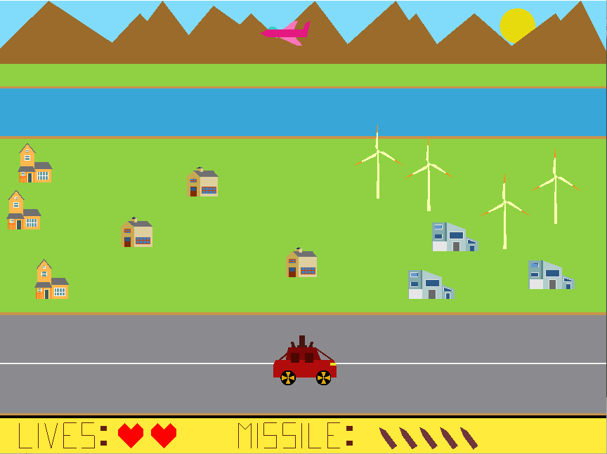

# World War
#### A 2D shooting game

## Tools used

* C++ - A general-purpose programming language
* OpenGL - A cross-language, cross-platform application programming interface for rendering 2D and 3D vector graphics

## Tools used

